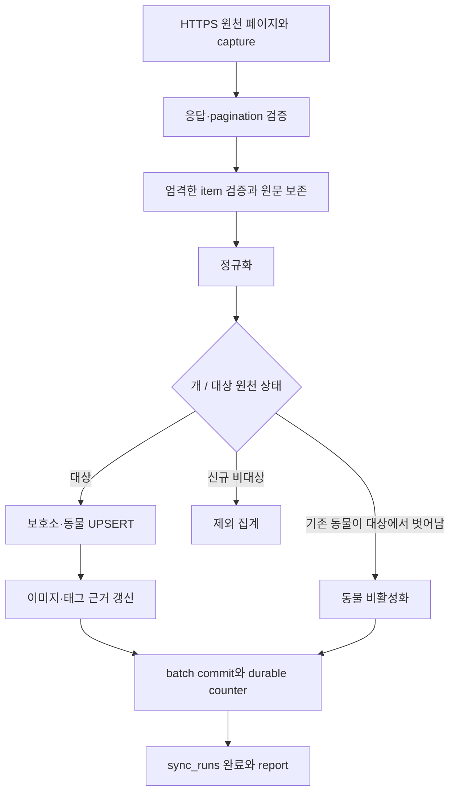

# 아키텍처

## 책임 경계

공개 경로는 브라우저/Workers → FastAPI → SQLAlchemy/psycopg → PostgreSQL입니다.
원천 API 호출은 수집 작업만 수행합니다. 페이지 요청이 원천 API를 조회하거나 데이터를 적재하지 않습니다.

| 경계 | 책임 | 주요 코드 |
| --- | --- | --- |
| 화면·SSR | 라우팅, loader, 응답 검증, 사용자 상태, SEO | frontend/app, frontend/workers |
| HTTP API | query 검증, 응답 모델, 오류·request ID·CORS | backend/app/api, schemas, core/http.py |
| 읽기 서비스 | 지역 표시, API 직렬화, 메타와 통계 | backend/app/services/animals.py |
| 읽기 저장소 | 파라미터 SQL, 읽기 snapshot, 필터·정렬·유사도 | backend/app/repositories/animals.py |
| 수집 | HTTPS 수신, 검증, 정규화, batch 처리 | backend/jobs/animal_sync |
| 수집 저장소 | UPSERT, 기록 보존, 이미지·태그 갱신 | backend/jobs/animal_sync/repositories.py |
| 구조 변경 | 명시적 Alembic migration | backend/migrations |

## 화면 요청

SSR loader와 브라우저 소비자는 같은 GET 전용 API client를 사용합니다.
홈·목록은 동물/필터 메타/태그를 병렬 조회합니다. 일반 timeout은 10초, 메타는 20초입니다.
상세와 유사 동물도 병렬 조회하며 유사 동물만 실패하면 상세는 표시합니다.

FastAPI는 요청마다 한국 날짜를 한 번 결정합니다. 읽기는 REPEATABLE READ + READ ONLY transaction에서
수행하고 transaction 안의 statement timeout을 적용합니다. 이미지·태그는 일괄 조회합니다.
목록의 total, 결과, 파생 상태와 자식 행은 같은 snapshot을 기준으로 합니다.

## 수집 흐름

batch별로 commit하므로 뒤 페이지가 실패해도 앞 batch는 이미 저장되어 있을 수 있습니다.
실행 전체는 session advisory lock을 보유해 협력하는 수집 작업의 중복 쓰기를 막습니다.
없는 자료가 삭제됐다고 추론하거나 전체 DB를 비우는 단계는 없습니다.

## 원문·파생 값·시간

raw_payload는 검증한 원천 snapshot을 JSONB로 보존합니다. 추가 필드는 유지하며 인증정보 echo는 수신 단계에서 제거합니다.
정규화된 값이 없으면 null을 사용합니다. 원문에 없는 품종·행동·진단을 생성하지 않습니다.

DB timestamp는 timezone-aware UTC입니다. 상태·연도 나이·오늘 신규 건수는 Asia/Seoul 날짜를 사용합니다.
시간대 없는 updTm은 raw_payload에 남기고 source_updated_at에는 넣지 않습니다.
상태와 나이는 조회 시 계산하며 API 캐시 수명도 KST 자정을 넘지 않게 제한합니다.

## 공개 범위와 보존

신규 수집 대상은 개 + 원천 상태 보호중/입양 가능입니다.
API 기본 조건은 species=dog와 is_active=true이며 상태 필터는 계산한 표시 상태에 적용합니다.
수동 DB 변경에도 이 경계를 유지합니다.

animals, animal_images, animal_tags의 is_active는 노출 여부입니다.
종료 동물과 빠진 원천 사진·태그는 과거 증거와 함께 남깁니다.
비대상으로 바뀐 동물의 자식 기록은 보존하며 공개 API에서 부모가 노출되지 않습니다.
조회 기간 밖의 자료와 실패한 수집에서 안 보인 자료는 자동 비활성화하지 않습니다.

## 배포 단위

- Workers: SSR bundle와 정적 assets. DB·원천 키를 받지 않습니다.
- Cloud Run: API-only Docker image. jobs·migration은 포함하지 않습니다.
- Supabase: PostgreSQL DB. Data API·Auth를 사용하지 않습니다.
- Actions: 저장소 소스와 Python CLI로 수집합니다.
- migration: 별도 관리 실행 환경에서 Alembic을 호출합니다.

구체적인 설정은 [인프라](infrastructure.md), 실제 구성 여부는 [운영 상태](operational-status.md)를 따릅니다.
