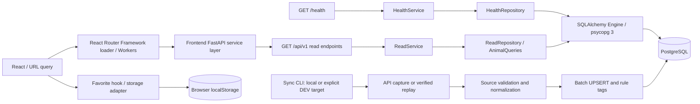

# FURBEBE Architecture — Phase 7

## 현재 실행 경로

전체 제품 경계는 Frontend → FastAPI → SQLAlchemy → PostgreSQL이다.
Phase 3 도메인 모델, Phase 4A sync, Phase 5 읽기 API를 Supabase DEV PostgreSQL에서 검증했다.
동물 목록·상세·비슷한 동물·태그·필터 메타·통계를 제공한다.
Phase 6은 `frontend/`에 React Router Framework SSR + Vite + JavaScript/JSX + Tailwind를 추가했다.
Phase 7은 Main과 목록의 탐색·관심 저장 UX를 구현했다. 상세는 Phase 6의 기본 화면을 유지한다.
최초 요청과 클라이언트 이동 모두 route loader → 공통 service → FastAPI v1을 사용한다.
프런트엔드에는 DB 연결·Supabase SDK·백엔드 비밀값을 전달하지 않는다.
국가 OpenAPI profiling과 production 형태의 sync job은 `backend/jobs/animal_sync/`에서 별도 진입점을 사용한다.

## 책임

| Frontend 위치 | 책임 |
| --- | --- |
| `frontend/app/routes.js`, `routes/` | Main, Dogs Listing, 기본 상세 및 URL query 기반 loader |
| `frontend/app/services/api.js` | 공개 API origin, GET 옵션, 취소·timeout·JSON·오류 정규화 |
| `frontend/app/services/animals.js`, `tags.js`, `meta.js` | FastAPI 도메인별 조회 경계 |
| `frontend/app/services/discovery.js`, `discovery-query.js` | 목록·메타·태그 병렬 로딩, query 파싱·직렬화·페이지 reset |
| `frontend/app/components/animal-card.jsx`, `discovery-filters.jsx`, `pagination.jsx`, `quick-discovery.jsx` | 사진 중심 카드, 탐색·모바일 필터 dialog, API 기반 페이지 이동 |
| `frontend/app/services/validation.js` | UI가 사용하는 JSON 구조의 가벼운 런타임 검사 |
| `frontend/app/services/favorites.js`, `hooks/use-favorites.js` | 저장소 adapter와 React 구독; UI에서 localStorage 분리 |
| `frontend/app/components/`, `styles/app.css` | 공통 상태·레이아웃·접근성·디자인 토큰 |
| `frontend/workers/app.js`, `vite.config.js`, `wrangler.jsonc` | Workers SSR, 공개 환경변수 allowlist, 로컬 실행·배포 dry-run |

상태 우선순위는 URL query → loader → component state → localStorage다.
favorites만 `furbebe:favorites`에 보존하며 SSR은 빈 snapshot으로 시작한다.
React Router loader가 Workers에서 API를 호출하므로 현재 화면은 브라우저 CORS에 의존하지 않는다.
이후 브라우저에서 service를 직접 호출한다면 FastAPI에 해당 frontend origin을 명시해야 한다.
frontend는 응답을 별도로 캐시하지 않는다. 자세한 실행·검증은 [Phase 6 보고](phase6-frontend-base.md)를 참조한다.
Main은 최근 등록 6건, 목록은 페이지당 24건을 요청한다. 목록·필터·태그는 API를 통해서만 가져온다.
지역 query에는 표시 이름 대신 공식 코드를 사용하며, 이름은 meta의 `sido_label`·`sigungu_labels`에서 받는다.
이 label들은 backend의 기존 공식 지역 매핑으로 생성한다. DB schema·sync·TRAIT 규칙 변경은 없다.
관심 버튼은 card link의 형제 요소로 두어 저장 클릭과 상세 이동을 분리한다.
필터·정렬 변경은 첫 페이지로 돌아가며 페이지 이동은 나머지 조건을 보존한다.
상세한 동작·접근성·검증 범위는 [Phase 7 보고](phase7-discovery.md)에 기록한다.

| 위치 | 책임 |
| --- | --- |
| `backend/app/main.py` | 앱 생성, lifespan의 engine 생성·정리, router와 middleware 등록 |
| `core/config.py` | 환경변수·로컬 `.env`, PostgreSQL URL 검증, production 설정 검사 |
| `core/database_target.py` | 운영 명령의 명시적 local/DEV 선택, DEV 프로젝트 일치·TLS·session 연결 검증 |
| `core/http.py` | UUID 요청 ID, 오류 envelope, 민감한 오류 내용 제거 |
| `api/health.py` | HTTP 계약; SQL 없음 |
| `api/animals.py` | 여섯 읽기 endpoint, query 검증, 응답 모델·캐시 헤더; SQL 없음 |
| `services/health.py` | DB 오류를 서비스 사용 불가로 변환 |
| `services/animals.py` | 요청별 KST 날짜, 명시적 응답 직렬화, 지역·메타 정책, 도메인 오류 |
| `services/regions.py`, `data/regions.json` | 기존 공식 참조 자료의 버전 고정 지역 코드 매핑; 요청 중 외부 API 없음 |
| `repositories/health.py` | `SELECT 1`로 연결 확인; 외부 HTTP 없음 |
| `repositories/animals.py` | 읽기 전용 snapshot, SQL 필터·정렬·페이지·추천·집계, 이미지·태그 일괄 조회 |
| `db/session.py` | connection pool, session 수명, 명시적인 transaction 소유권 |
| `db/models/` | SQLAlchemy metadata, UTC timestamp, 여섯 domain table과 relationship |
| `schemas/common.py` | health 및 공통 오류 응답 모델 |
| `schemas/animals.py` | ORM과 분리된 Pydantic query·응답 모델 |
| `backend/migrations/` | Alembic online/offline 환경과 초기 revision `20260915_0001` |
| `jobs/animal_sync/main.py` | local/DEV 대상 선택, 날짜 범위·API 기본 범위·replay 선택, JSON 결과 |
| `jobs/animal_sync/capture.py`, `pagination.py` | SHA-256 capture·사전 replay 검사, 페이지 완전성 검사 |
| `jobs/animal_sync/source_models.py`, `normalizer.py` | strict source 검증, raw 보존, nullable 정규화 사실 |
| `jobs/animal_sync/service.py`, `repositories.py` | advisory lock, batch transaction, UPSERT·자식 행 갱신·실행 집계 |
| `jobs/animal_sync/tagger/` | 구조화 FACT와 대응 VIBE, generator/version/evidence 기록 |
| `jobs/animal_sync/verification.py` | schema·무결성 집계·원문 대비 SQL 샘플 검증; 호출자가 읽기 전용 transaction 지정 |
| `jobs/read_api_verification.py` | 실제 Uvicorn HTTP → DEV DB 읽기 검증, SQL 수·시간·데이터 불변성 확인 |

## 연결과 트랜잭션

- lifespan은 engine을 준비하되 실제 DB 연결은 요청 시 생성한다.
- pool은 기본 5개, overflow 최대 5개, 대기 최대 5초다. pre-ping을 사용한다.
- 연결·statement timeout은 환경변수로 제한한다. PostgreSQL URL의 TLS query 설정은 유지한다.
- 읽기 API는 요청당 `REPEATABLE READ`, `READ ONLY` transaction을 사용한다.
  session pooler의 시작 옵션 처리에 의존하지 않도록 `SET LOCAL statement_timeout`으로
  `DB_STATEMENT_TIMEOUT_MS`(기본 5,000ms)를 적용한다.
- session context가 종료되면 닫고, commit되지 않은 작업은 rollback한다. 자동 commit하지 않는다.
- 앱 시작 시 `create_all`, migration, source 수집을 수행하지 않는다.
- 도메인 model과 migration의 PK/FK·제약·인덱스·삭제 정책은 [DB schema](database-schema.md)에 기록한다.
- 운영 timestamp는 TIMESTAMPTZ, Python default와 PostgreSQL connection timezone은 UTC다.
- Supabase DEV는 SQLAlchemy → psycopg → PostgreSQL 연결로 사용한다. Data API·Realtime·Edge Functions는 사용하지 않는다.
- sync는 기본 local이며 `--database-target supabase-dev`로만 원격 DEV를 선택한다.
  Alembic과 앱은 `FURBEBE_DATABASE_TARGET=supabase-dev`를 명시할 수 있다.
  이 선택이 없으면 앱은 기존 `DATABASE_URL`을 사용한다.
- `DATABASE_URL_dev`와 `SUPABASE_URL_dev`의 프로젝트 일치를 확인한다. 직접 연결 또는 5432 session pooler와 TLS를 사용한다.
  세션 advisory lock을 사용하므로 6543 transaction pooler는 거부한다.
- 동일 동물 내용은 `last_seen_at`만 갱신하고 `unchanged_count`로 센다. 동물 내용 변경만 `updated_count`로 센다.

## 응답과 설정

- `/health`는 API v1 prefix 밖에 있으며, DB 성공 200 / 실패 503이다.
- 여섯 `/api/v1` endpoint는 모두 GET이며 별도 Pydantic 응답 모델을 사용한다.
- 목록은 count·본체·이미지·태그의 SQL 4회이며 페이지 크기에 따라 쿼리 수가 늘지 않는다.
  태그 필터를 지정하면 사전 존재 확인 1회가 추가된다.
- `X-Request-ID`는 유효한 UUID면 재사용하고 나머지는 생성한다.
- public 오류에 SQL·DB host·credential·입력값을 노출하지 않는다.
- 응답에 `raw_payload`, favorite 정보, `animals_active`를 넣지 않는다.
- 성공 캐시 TTL은 endpoint별 60/300/600초이며 KST 자정을 넘지 않도록 제한한다.
- CORS는 명시한 origin만 허용한다. production은 HTTPS origin과 DB URL이 필요하다.
- Docker는 non-root UID 10001, 8080 port, JSON health 검사로 실행한다.
- 키·raw capture는 image build context에서 제외한다.

## 현재 읽기 정책과 후속 범위

[확정 결정](phase1-5-product-decisions.md)을 읽기 API에도 적용한다.
체중·나이 A안, `animals_active` 제외, 근거 있는 설명의 선택 제공이 확정됐다.
현재 metadata에는 여섯 domain table이 있고 OpenAPI schema에는 일곱 GET endpoint가 있다.
`animals`에는 체중·출생연도 사실을 저장하며 그룹 컬럼은 없다. 요청 시 그룹은 service/query에서 계산한다.
sync가 생성한 FACT/VIBE 태그는 관측 시점의 파생 정보이므로 연도 변경 후 읽기 API에서 age 필터의 기준으로 삼지 않는다.
현재 그룹과 맞지 않는 기존 `rules/1.0` 나이 태그는 조회에서 제외하며 읽기 중 새 태그를 만들지 않는다.
나이는 요청 시 KST 연도에서 출생연도를 빼고, `new_today`는 KST 오늘의 `first_seen_at`으로 센다.
표시 상태는 원문이 `보호중`이고 공고 시작일에서 10일 이상 경과했을 때 `입양 가능`이며 DB 원문은 유지한다.
지역 query와 응답의 sido/sigungu는 공식 코드다. 표시 이름은 region.display로 제공한다.
로컬 sync의 범위·실패 처리·검증 수치는 [Phase 4A 문서](phase4a-local-sync.md)에 기록한다.
현재 DEV 검증과 counter 정책은 [동기화 운영 문서](sync-design.md)를 기준으로 한다.
`--full`은 API 기본 조회의 전 페이지 수집이다. 날짜 생략을 과거 전체 이력 수집으로 해석하지 않는다.
후보 키워드로 production 성격 태그나 건강 진단을 생성하지 않는다.
Docker build/run은 미검증이며 현 blocker가 아니다. 실제 컨테이너 검증은 deployment 단계에서 수행한다.
Phase 5의 검증 수치·실행 방법·한계는 [읽기 API 완료 보고](phase5-read-api.md)를 참조한다.
Phase 7 Main/Listing을 구현했으며 Phase 8은 사용자 승인 전 시작하지 않는다.
