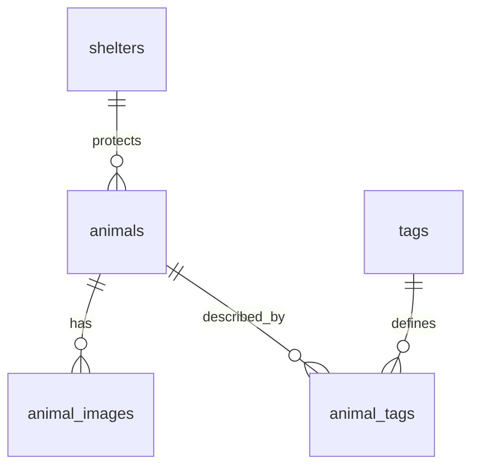

# PostgreSQL 스키마와 마이그레이션

기준은 backend/app/db/models와 backend/migrations입니다. 단일 head는 **20261005_0005**입니다.
앱 시작이나 수집은 테이블을 자동 생성하지 않습니다.

## 관계와 테이블



| 테이블 | 식별·주요 내용 |
| --- | --- |
| shelters | UUID PK; 원천/source_id, 이름·전화·주소·기관 |
| animals | UUID PK; 원천/source_id, 공고, 품종·성별·체중·출생연도, 원문 설명, raw_payload JSONB, 시간, is_active |
| animal_images | UUID PK; animal_id, image_url, sort_order, image_type, is_active |
| tags | key text PK; type, label, emoji, description, display_order, is_active |
| animal_tags | UUID PK; animal_id, tag_key, confidence, evidence, rule_id, generator/version, is_active |
| sync_runs | UUID PK; source, 시작·종료, status, 페이지·수신·신규·갱신·오류 건수 |
| alembic_version | 적용 revision; Alembic 관리 |

animals/shelters의 (source, source_id)는 UNIQUE입니다.
이미지의 (animal_id, image_url), 배정의 (animal_id, tag_key, generator, generator_version)도 UNIQUE입니다.
API는 활성 사전·활성 배정 중 animal/key별 가장 최근 한 행만 반환합니다.

## 제약과 인덱스

- source·source_id·tag key·generator/version은 빈 문자열을 거부합니다.
- weight_kg는 유한하고 0 이상인 Numeric이며 null을 허용합니다.
- birth_year는 1~9999 제약에 더해 정규화 시 현재 연도까지로 제한합니다.
- sex는 male/female/unknown, neutered는 yes/no/unknown입니다.
- raw_payload는 JSON object여야 합니다.
- tag type은 fact/trait/vibe, confidence는 0~1, display_order는 0 이상입니다.
- sync status는 running/success/failed, counter는 음수 불가, 종료는 시작 이후입니다.
- 보호소 FK와 태그 사전 FK는 RESTRICT입니다.
- 동물의 이미지·태그 FK는 CASCADE이므로 동물 물리 삭제는 자식도 삭제합니다.

animals 인덱스: process_state, found_date, notice_end, shelter_id, breed, sex, weight_kg, birth_year.
이미지는 (animal_id, sort_order), 태그 역조회는 (tag_key, animal_id)를 사용합니다.
지역은 raw_payload.orgNm을 공백 정리해 정적 지역 사전과 연결합니다. 구조화 지역 컬럼은 없습니다.

## 원문과 가시성

process_state는 원천 값입니다. 표시 상태·size_group·age_group은 조회 시 계산합니다.
first_seen_at은 첫 적재, last_seen_at은 마지막 관측, source_updated_at은 시간대가 확인된 원천 시각입니다.
내용이 같으면 last_seen_at만 갱신하고 updated_at은 보존합니다.

비활성화는 정상 reconciliation 경로입니다. 종료 동물, 빠진 이미지와 근거가 사라진 자동 태그를 남깁니다.
미수신 행을 일괄 삭제하거나 조회 기간 밖의 동물을 자동 정리하지 않습니다.

## revision 구성

| revision | 구조·역할 |
| --- | --- |
| 20260915_0001 | 여섯 도메인 테이블, 제약, 인덱스 |
| 20261003_0002 | 태그 표시 정보 갱신 |
| 20261003_0003 | 태그 중복 표시 병합 |
| 20261003_0004 | 사용하지 않는 태그 비활성화 |
| 20261005_0005 | animals/animal_images/animal_tags에 is_active 추가, 태그 비활성 정책 적용 |

migration은 삭제하지 않고 구조 변경 시 새 revision을 추가합니다.
일반 운영 rollback으로 downgrade를 실행하지 않습니다.
현재 head의 downgrade는 보존 metadata 손실을 막기 위해 명시적으로 실패합니다.

## 실행

저장소 루트와 설정된 대상에서 수행합니다. 운영 변경 전에는 [백업](operations.md)과 계획 검토가 필요합니다.

```sh
backend/.venv/bin/python -m alembic -c backend/alembic.ini heads
APP_ENV=development FURBEBE_DATABASE_TARGET=supabase-dev backend/.venv/bin/python -m alembic -c backend/alembic.ini current
backend/.venv/bin/python -m alembic -c backend/alembic.ini upgrade head --sql
```

--sql은 접속 없이 base→head SQL을 만듭니다. 미적용 구간만 보려면 current:head 범위를 사용합니다.
운영 preflight는 DB revision, 적용 구간·SQL·migration checksum을 출력하며 변경하지 않습니다.

```sh
APP_ENV=production backend/.venv/bin/python -m backend.jobs.production_preflight
```

검토된 적용 명령:

```sh
APP_ENV=production FURBEBE_DATABASE_TARGET=supabase-prod backend/.venv/bin/python -m alembic -c backend/alembic.ini upgrade head
```

이 명령은 실제 DB를 변경합니다. SQL 출력과 구분합니다.
적용 후 current=head, 테이블·제약·API를 확인합니다. stamp로 구조 누락을 숨기지 않습니다.
실제 최초 적재 기록은 [운영 상태](operational-status.md)에 있습니다.
