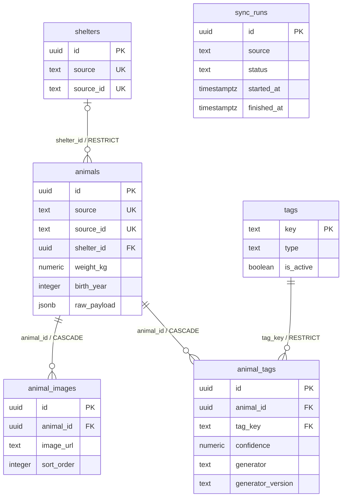

# Phase 3 — Domain Database Schema

작성일: 2026-09-15, Asia/Seoul. 범위: SQLAlchemy 2.x 모델과 PostgreSQL 초기 Alembic migration.

## 결과와 범위

여섯 domain table과 revision `20260915_0001`을 구현했다. 사용자의 최신 Phase 3 지시,
개발 지시서 §7·§36, [v1 API Contract](api-contract.md)를 기준으로 한다.
모델은 `backend/app/db/models/`, 응답 schema는 `backend/app/schemas/`로 분리한다.
앱 시작 시 DDL을 실행하지 않으며, 현재 endpoint는 `/health`뿐이다.

새 OpenAPI 수집, 실데이터 적재, sync/UPSERT, 동물 endpoint, production tag seed/rule은 없다.
Supabase 전용 기능이나 외부 DB migration도 추가·실행하지 않았다.
기존 로컬 PostgreSQL 실행 파일을 재사용했으며 Docker 설치와 개발 도구 변경은 하지 않았다.

**Docker build/run 미검증. 현재 blocker가 아니며 실제 컨테이너 검증은 deployment 단계에서 수행한다.**

## 확정 제품 정책: 사실만 저장

`size_group`, `age_group`, `estimated_age`는 일반 컬럼·generated column·DB view 어디에도 저장하지 않는다.
사실인 `weight_kg`, `birth_year`만 저장하고 이후 service/query layer에서 계산한다.
그룹 변경에 따른 데이터 backfill과 연도 변경에 따른 age 갱신 작업을 피할 수 있다.
`weight_kg`/`birth_year` B-tree로 범위 필터를 지원하므로 현재 중복 저장이 필요하지 않다.
아래는 향후 계산 규칙이며 이번 Phase에 계산 service나 endpoint를 구현한 것은 아니다.

| size_group | 기준 |
| --- | --- |
| tiny | `weight_kg <= 5` |
| small | `5 < weight_kg <= 10` |
| medium | `10 < weight_kg <= 20` |
| large | `weight_kg > 20` |
| unknown | `weight_kg IS NULL` |

| age_group | 기준: `estimated_age = 현재 연도 - birth_year` |
| --- | --- |
| puppy | `estimated_age <= 1` |
| young | `2 <= estimated_age <= 4` |
| adult | `5 <= estimated_age <= 8` |
| senior | `estimated_age >= 9` |
| unknown | `birth_year IS NULL` |

생일을 모르는 내부 탐색용 추정치다. v1 서비스는 요청 기준 연도를 한 번 정하고
출생연도 범위 조건으로 변환해 필터해야 한다. 정확한 만 나이나 성견 크기로 표현하지 않는다.
최신 사용자 지시에 따라 unknown은 NULL 기준이다. 0kg를 임의로 NULL로 바꾸지 않고 DB에서 보존한다.
없는 체중을 0으로 채우는 default도 없다. Phase 1.5의 0kg unknown 후보는 과거 제안이다.

`animals_active`는 v1 schema/view/API에서 제외한다. `process_state`는 원본 문자열이며
`보호중`만으로 입양 가능 여부·active count를 추론하지 않는다.
기존 화면 표시 정책과 raw state의 차이는 [profiling 결정](api-profiling-decisions.md)에 보존한다.

행동 evidence coverage **45.88%**, 건강 evidence coverage **11.10%**는 profiling의 탐지율이다.
모든 동물에게 tag나 설명을 강제하지 않는다. 근거가 있을 때 원문 기반 설명을 선택 제공하며,
없는 source text는 NULL이다. `animal_tags` 행이 0개인 animal도 정상이다.

## ERD와 table 목적



ERD의 `source`/`source_id` UK는 각 컬럼 단독이 아닌 복합 UNIQUE다.

| Table | 목적 | PK |
| --- | --- | --- |
| shelters | 원천별 보호소 식별자와 현재 연락 정보 | UUID `id` |
| animals | 원문과 정규화 사실, 관측 시각 보존 | UUID `id` |
| animal_images | animal별 외부 이미지 URL과 표시 순서 | UUID `id` |
| tags | 향후 사용할 표시 사전 구조; 초기에는 비어 있음 | TEXT `key` |
| animal_tags | tag 연결과 생성 주체·버전·evidence | UUID `id` |
| sync_runs | 향후 sync 실행 상태와 집계 구조; 이번에는 job 없음 | UUID `id` |

UUID는 Python `uuid4()`로 INSERT 시 생성한다. SQL 직접 INSERT는 UUID를 전달해야 한다.
DB extension, Supabase auth/RLS/storage, provider 전용 default는 필요하지 않다.

## 컬럼과 nullable 정책

식별·운영 필수값 외의 관측 사실은 누락될 수 있으므로 nullable이다.
TEXT에는 임의 길이 제한을 두지 않아 원문을 잘라 저장하지 않는다.
`species`는 정규화 문자열을 위한 nullable TEXT이며 원천 동물 종류의 확장을 DB enum으로 차단하지 않는다.

### animals — 34 columns

| 컬럼 | SQL 타입 | NULL | 설명 |
| --- | --- | --- | --- |
| id | UUID | 불가 | 내부 식별자 |
| source, source_id | TEXT | 불가 | 예: `national_animal_api`, 원본 `desertionNo`; 공백 불가 |
| notice_no, rfid_code | TEXT | 허용 | 공고·RFID 식별자; 전역 UNIQUE로 가정하지 않음 |
| species, breed, breed_full | TEXT | 허용 | 정규화 종류·품종·전체 품종 표기 |
| sex | TEXT | 허용 | `male`, `female`, `unknown` |
| neutered | TEXT | 허용 | `yes`, `no`, `unknown` |
| age_text, birth_year | TEXT, INTEGER | 허용 | 원문과 파싱 출생연도 |
| weight_text, weight_kg | TEXT, NUMERIC | 허용 | 원문과 파싱 체중; Decimal로 처리 |
| color_text | TEXT | 허용 | 색상 원문 |
| found_date, found_place | DATE, TEXT | 허용 | 발견일·장소 |
| process_state, end_reason | TEXT | 허용 | 원천 상태·종료 사유; 의미 미확정이면 추측하지 않음 |
| notice_start, notice_end | DATE | 허용 | 공고 기간 |
| special_mark, social_text, health_text | TEXT | 허용 | source text; 설명 default 없음 |
| etc_text, vaccination_text, health_check_text | TEXT | 허용 | source text; 설명 default 없음 |
| shelter_id | UUID | 허용 | 보호소 식별 불가 시 NULL, 가짜 보호소 생성 금지 |
| raw_payload | JSONB | 불가 | JSON object 필요; SQL NULL/JSON null/배열 불가, 빈 object default 없음 |
| first_seen_at, last_seen_at | TIMESTAMPTZ | 불가 | 최초·최근 관측 시각 |
| source_updated_at | TIMESTAMPTZ | 허용 | timezone을 확정할 수 있는 원천 수정 시각만 |
| created_at, updated_at | TIMESTAMPTZ | 불가 | DB 행 생성·수정 시각 |

JSONB는 원천 object의 값 보존용이며 원본 byte 순서·공백·중복 JSON key까지 보존하는 포맷은 아니다.
원본 capture는 별도 profiling 파일에 그대로 남긴다. 이후 갱신은 `raw_payload` 전체 object를 교체해야 한다.
현재 plain JSONB ORM 매핑은 dict 내부의 in-place 변경을 자동 추적하지 않는다.

NUMERIC에는 precision/scale을 고정하지 않아 `5.0001`이나 confidence `1.0001`을
저장 전에 반올림하지 않는다. 체중은 finite·0 이상이고 임의의 최대 kg를 정하지 않았다.
`birth_year`는 1~9999 정수만 허용한다. 미래 연도·원천 파싱 실패 처리는 향후 normalizer 책임이며,
시간이 흐르면 달라지는 `CURRENT_DATE` 기반 CHECK를 두지 않는다.
관측된 날짜 역전 자료를 고려해 원천 공고일 사이의 순서 CHECK도 강제하지 않는다.

### 다른 tables

| Table | NOT NULL 컬럼 | Nullable 컬럼 |
| --- | --- | --- |
| shelters | id, source, source_id, created_at, updated_at | name, phone, address, owner_name, organization |
| animal_images | id, animal_id, image_url, sort_order, created_at | image_type |
| tags | key, type, label, is_active, display_order, created_at, updated_at | emoji, description |
| animal_tags | id, animal_id, tag_key, confidence, generator, generator_version, created_at | evidence, rule_id |
| sync_runs | id, source, started_at, status, page_count, received_count, inserted_count, updated_count, error_count, created_at | finished_at, error_message |

이미지 URL은 TEXT이고 binary 컬럼은 없다. `sort_order`/`display_order`는 INTEGER 기본 0,
`tags.is_active`는 BOOLEAN 기본 true다. `image_type`은 원천 이미지 종류를 위한 열린 TEXT다.
tag `type`은 TEXT + CHECK(`fact`, `trait`, `vibe`)로 제한하며 PostgreSQL native enum은 만들지 않는다.

`confidence`는 필수 NUMERIC 0~1이며 자동 1.0 default는 없다. 통계적 확률로 표시하지 않는다.
`evidence`는 fact tag의 구조화된 필드 근거도 지원하도록 nullable이다.
이 허용이 behavior/health의 근거 없는 생성을 승인하는 것은 아니다. 원문이 필요한 설명의 노출 검사는
향후 service/rule에서 수행하며 이번에는 생성기를 추가하지 않는다.
generator/version은 공백과 NULL을 금지하고, rule이 없는 생성 방식은 `rule_id=NULL`로 둘 수 있다.

sync counter는 INTEGER 기본 0, 모두 0 이상이다. status는 TEXT + CHECK(`running`, `success`, `failed`),
기본 running이다. started_at은 필수, finished_at은 nullable이며 있으면 started_at 이후여야 한다.
status 전이와 terminal 상태의 finished_at 기록은 향후 job 책임이다. DB는 전이 순서를 구현하지 않는다.
실행 요약에는 FK를 만들지 않아 동물의 수명과 독립적으로 보존한다.

## 보호소 고유키: 기존 profiling 재확인

기존 run `20260914T232312940282Z`의 원본 **17,000건**만 읽어 확인했다. 네트워크 요청은 0회다.

| 항목 | 결과 |
| --- | --- |
| 전체 distinct careRegNo | 300 |
| careRegNo 누락 | 0 / 17,000 |
| 같은 careRegNo 내 careNm 충돌 | 0개 ID |
| 같은 careRegNo 내 careAddr 충돌 | 0개 ID |
| 같은 careRegNo 내 orgNm 충돌 | 0개 ID |
| 같은 careRegNo 내 careTel 여러 값 | 19개 ID |
| 개 subset | 10,507건, 277개 ID, 이름·주소 충돌 0 |

따라서 `UNIQUE(source, source_id)`를 적용하고 source_id에 careRegNo를 보존하는 설계가
현재 자료와 충돌하지 않는다. 문자열 식별자를 정수로 변환하거나 이름·주소를 unique key로 쓰지 않는다.
전화번호 변경은 동일 보호소 identity를 나눌 근거가 아니며, 원문 값은 각 animal의 raw_payload에 남는다.
어느 연락처를 최신으로 채택하는지는 Phase 4의 갱신 정책에서 다룬다.

현재 표본의 무충돌이 전 기간의 동일성을 보증하지는 않는다.
참조 코드의 보호소 소속 membership은 지역별로 나타날 수 있으며, 보호소 주소를 동물 관할로 간주하지 않는다.
캐시에 없는 개 보호소 코드 11개/479건도 원본 ID를 그대로 사용할 수 있다.
지역 원문은 animal.raw_payload의 orgNm 등으로 보존한다. 정규화 지역 컬럼·검색 인덱스가 필요하면
Phase 4의 코드 연결 검증을 근거로 후속 migration에서 추가한다.

## Unique constraints와 CHECK

| 이름 | 컬럼 / 의미 |
| --- | --- |
| uq_shelters_source_source_id | (source, source_id) |
| uq_animals_source_source_id | (source, source_id) |
| uq_animal_images_animal_id_image_url | (animal_id, image_url) |
| uq_animal_tags_animal_tag_generator_version | (animal_id, tag_key, generator, generator_version) |

이미지는 같은 animal의 동일 URL만 금지한다. 서로 다른 animal은 같은 URL을 사용할 수 있고,
같은 sort_order도 허용하되 ORM에서 `(sort_order, id)`로 안정적으로 정렬한다.
URL의 query string·대소문자를 임의 정규화하지 않는다. 매우 긴 URL은 PostgreSQL B-tree entry 크기
제한에 걸릴 수 있으므로 향후 그런 원천이 관측되면 해시 기반 unique 설계를 별도 검토한다.

태그 연결의 네 컬럼은 모두 NOT NULL이므로 NULL로 uniqueness가 우회되지 않는다.
다른 generator/version의 근거는 함께 보존할 수 있다. 향후 읽기 service가 여러 버전 중
노출할 근거를 선택해야 하며, migration이 이를 최신 버전 하나로 삭제하지 않는다.

CHECK는 의미 있는 이름으로 관리한다: source/source_id/key/generator/version/URL 공백 금지,
sex/neutered/tag type/sync status의 허용 값, confidence 범위, finite 비음수 체중,
birth_year 범위, JSON object, 비음수 순서·counter, sync 종료 시각 순서다.
source `process_state`, `end_reason`, 원문 문장은 enum/CHECK로 제한하지 않는다.

## Index: v1 query 목적

모두 B-tree다. 아래 **10개 explicit index** 외에 PK 6개와 UNIQUE 4개가 만드는 인덱스가 있다.
같은 선두 컬럼을 가지는 중복 FK 인덱스는 추가하지 않았다.

| Index | 지원할 v1 query |
| --- | --- |
| animals(process_state) | 목록 `process_state=` exact filter, meta 상태 집계 |
| animals(found_date) | 목록 `sort=recent`의 선두 정렬; source_updated_at/id tie-break는 query에서 추가 |
| animals(notice_end) | 목록 `sort=notice_end`, 공고 종료일 조회 |
| animals(shelter_id) | 목록/상세의 보호소 JOIN, 보호소별 동물·지역 후보 연결 |
| animals(breed) | 품종 equality filter와 품종 meta; 부분 문자열 q 검색을 가속한다고 주장하지 않음 |
| animals(sex) | 목록 `sex=` filter; 다른 선택 조건과 bitmap 결합 가능 |
| animals(weight_kg) | size_group의 체중 범위·NULL 조건, weight_asc/desc |
| animals(birth_year) | age_group의 출생연도 범위·NULL 조건, age_youngest/oldest |
| animal_tags(tag_key, animal_id) | `tag=` any/all 매칭과 animal 역조회 |
| animal_images(animal_id, sort_order) | 목록 대표 이미지와 상세 gallery 순서 |

상태·성별은 낮은 cardinality 때문에 query에 따라 sequential scan이 더 유리할 수 있다.
현재는 query 지원 구조를 검증했으며 데이터 적재 후 EXPLAIN 성능 측정은 하지 않았다.
복합 정렬 covering index, JSONB GIN, 전문 검색, sync status/boolean 단독 인덱스는 추가하지 않았다.
`stats.last_synced_at`은 초기 소규모 sync_runs 집계로 충분하며 실제 이력량과 query가 확정되면 검토한다.

## FK / ON DELETE와 보존

| FK | ON DELETE | 선택 이유 |
| --- | --- | --- |
| animals.shelter_id → shelters.id | RESTRICT | 참조 중 보호소 삭제를 거부하여 animal과 보호소 연결 보존 |
| animal_images.animal_id → animals.id | CASCADE | 삭제한 animal에만 속하는 이미지 연결 정리 |
| animal_tags.animal_id → animals.id | CASCADE | 삭제한 animal에만 속하는 tag 연결 정리 |
| animal_tags.tag_key → tags.key | RESTRICT | 근거 이력의 사전을 삭제하지 않고 is_active=false로 비활성화 |

보호소·tag 부모 관계는 ORM `passive_deletes="all"`로 설정했다.
자식을 미리 읽어 둔 경우에도 ORM이 FK를 NULL로 바꾸지 않고 DB의 RESTRICT를 따른다.
animal 소유 관계는 `cascade="all, delete-orphan"`, `passive_deletes=True`다.
동물을 명시적으로 hard delete하거나 collection에서 자식 연결을 제거할 때만 해당 자식이 삭제된다.
FK 정책은 animal 삭제 기능을 제공한다는 뜻이 아니며 서비스에서는 보존을 우선한다.
CASCADE는 URL 연결 행만 삭제하고 외부 이미지 파일에는 아무 작업도 하지 않는다.

## Timestamp와 갱신 책임

운영 timestamp 14개 모두 `TIMESTAMPTZ` (`DateTime(timezone=True)`)다.
Python default/onupdate는 `datetime.now(UTC)`, DB 생성 default는 `now()`를 사용한다.
애플리케이션/Alembic 연결 timezone은 UTC로 설정한다. PostgreSQL은 TIMESTAMPTZ를 UTC instant로
저장하고 connection timezone에 따라 표시한다. [PostgreSQL 날짜·시간 문서](https://www.postgresql.org/docs/current/datatype-datetime.html)

`updated_at`은 SQLAlchemy UPDATE 시 갱신한다. DB trigger는 없으므로 향후 SQL/UPSERT는 이를 명시해야 한다.
`first_seen_at`은 유지하고 `last_seen_at`은 실제 관측에 맞춰 job이 갱신해야 하며 단순 ORM 수정으로 바뀌지 않는다.
입력 datetime은 timezone-aware 값만 전달하는 것을 Python writer의 규약으로 한다.
원천 `updTm`의 timezone이 불명확하면 `source_updated_at=NULL`로 두고 raw_payload 값을 유지한다.
TIMESTAMPTZ 자체가 입력 timezone의 진위를 검증해 주지는 않는다.

## Alembic 실행과 검증

초기 graph: `base → 20260915_0001 (head)`. 부모 table부터 생성하고 downgrade는 자식부터 제거한다.
revision은 명시적인 `op.create_table/create_index`를 포함하고 현재 ORM metadata를 import하지 않는다.
native PostgreSQL enum·extension·seed·trigger·view는 없다.

프로젝트 루트에서 **전용 빈 PostgreSQL 테스트 DB**를 `DATABASE_URL`에 설정한 뒤:

```powershell
.\.venv\Scripts\python.exe -m alembic -c backend/alembic.ini upgrade head
.\.venv\Scripts\python.exe -m alembic -c backend/alembic.ini downgrade -1
.\.venv\Scripts\python.exe -m alembic -c backend/alembic.ini upgrade head
.\.venv\Scripts\python.exe -m alembic -c backend/alembic.ini check
```

`downgrade -1`은 여섯 table과 데이터를 제거한다. 위 재현은 disposable test DB 전용이다.
실제 서비스 배포는 검토된 forward migration만 적용하며 production rollback은 데이터 보존 계획이 필요하다.

### 검증 결과

기존 `.local/phase2/pg-package/`의 **PostgreSQL 18.6**을 재사용하여 루프백에 실행했다.
기존 Phase 2 DB와 다른 신규 `furbebe_test_phase3_20260915_044957` DB를 생성했다.
SQLite 대체 검사 없이 실제 PostgreSQL에서 검증했다. 합성 fixture는 transaction rollback으로 제거한다.
원본 17,000건과 manual-review CSV는 수정하지 않았고 실데이터를 DB에 적재하지 않았다.

| 항목 | 결과 |
| --- | --- |
| metadata / mapper / PostgreSQL DDL | 여섯 table 생성, 관계 등록, JSONB·UUID·TIMESTAMPTZ 확인 |
| migration | upgrade → downgrade -1 → upgrade 성공, 반복 upgrade/current/check 성공 |
| schema 일치 | ORM/Alembic 차이 없음; CHECK는 별도 introspection·실제 invalid INSERT로 보완 |
| constraints | UNIQUE, FK, nullable, enum CHECK, confidence 0/1 허용·범위 밖 거부 |
| 보존 | JSONB 한글, 소수 체중, NULL 설명, 알려지지 않은 process_state 보존 |
| delete | 자식 loaded/unloaded 모두 CASCADE·RESTRICT 실검증 |
| 시간 | UTC read/write, updated_at 수정, first/last_seen 자동 덮어쓰기 없음 |
| 전체 Phase 0~3 pytest | **213 passed**, 기존 의존성 deprecation warning 2개; PostgreSQL 검사도 실행 |
| Ruff | `ruff check .` 통과, 수정한 DB·migration·test 14개 파일 format 검사 통과 |
| Docker | build/run 미검증, deployment 단계로 보류, 현 blocker 아님 |

전체 213개는 기존 Phase 0~2 검사 163개(현재 domain schema에 맞춰 기대값을 갱신한 검사 포함)와 신규 50개다.
경고는 설치된 Starlette의 httpx test client와 AnyIO BlockingPortal alias에 관한 것이며 테스트 실패가 아니다.
의존성을 교체하거나 개발 환경을 변경하지 않았다.

일반 검사는 `python -m pytest backend/tests -q`다. PostgreSQL 통합 검사는 별도
`FURBEBE_TEST_DATABASE_URL`을 명시해야 하며 일반 `.env` DATABASE_URL로 자동 실행하지 않는다.
DB 이름은 `furbebe_test`로 시작해야 한다. roundtrip은 예상 외 table이나 domain 데이터가 있으면 중단한다.
`alembic check`는 CHECK 등 일부 변경 탐지를 지원하지 않으므로 단독 완전성 증명으로 사용하지 않는다.
[Alembic autogenerate 한계](https://alembic.sqlalchemy.org/en/latest/autogenerate.html)

## Phase 4B Supabase DEV 검증 — 2026-09-16

아래 향후 작업 목록은 Phase 3 완료 당시 기록이다. 이후 승인된 Phase 4B에서 Supabase DEV
PostgreSQL 17.6에 같은 revision `20260915_0001`을 적용했다. migration rewrite나 새 revision은 없다.
여섯 domain table의 컬럼 타입·nullable·TIMESTAMPTZ·JSONB·PK·FK·UNIQUE·CHECK·인덱스를 비교했으며
로컬 PostgreSQL manifest 차이와 SQLAlchemy metadata 차이는 모두 0이다.

DEV는 처음 연결할 때 빈 public schema임을 확인했다. 이후 검증은 읽기 전용 transaction에서 수행했고,
7,290건 적재 후 중복·고아 관계·confidence 범위 위반도 모두 0이다.
DEV에 downgrade·DROP·RESET을 실행하지 않았으며 전체 pytest의 migration 왕복 검증은 별도 로컬 테스트 DB에서 수행했다.
실행 명령·전체 수치·증거 경로는 [동기화 운영 문서](sync-design.md)에 기록한다.

## Phase 3 당시 향후 migration 고려사항과 남은 작업

- Phase 4는 사용자 승인 전 시작하지 않는다. 원천 정규화, 연락처 갱신, source timestamp timezone,
  멱등 sync와 트랜잭션·counter 의미는 해당 단계에서 구현한다.
- careRegNo의 장기 충돌이 관측되면 identity 정책과 backfill을 검토한다. 이름·전화번호로 자동 병합하지 않는다.
- 지역 코드·표시값의 materialization과 query 계획은 동물 관할 원문·검증된 코드 연결에 근거해야 한다.
- 공고·RFID 전역 UNIQUE, 상태 enum, tag evidence의 필수 조건을 현재 자료보다 강하게 가정하지 않는다.
- tag/rule 배포 전에 manual-review 100건을 사람이 검토해야 한다. 현재 review_notes는 모두 비어 있다.
  이는 schema 완성 blocker가 아니며 production tag 품질 gate로 남긴다.
- DB index 효과·긴 URL 처리·version별 tag 노출은 실제 적재·read query 단계에서 검증한다.
- Supabase 프로젝트 URL과 API key는 PostgreSQL SQL 접속 문자열이 아니다. 외부 DB 적용에는 별도의
  SQL `DATABASE_URL`과 대상 검토가 필요하며 이번에는 로컬 PostgreSQL 검증으로 Phase 3을 완료한다.
- Docker build/run과 실제 deployment 대상 migration은 deployment 단계의 검증 항목이다.

ORM FK와 삭제 동작은 [SQLAlchemy cascade 문서](https://docs.sqlalchemy.org/en/20/orm/cascades.html)의
`passive_deletes`와 DB `ON DELETE` 연동을 따른다. 이번 구현에는 사용자 기능이나 자동 삭제 job이 없다.

**Phase 3 완료. 현재 구현 blocker 없음. Phase 4는 사용자 승인 대기이며 시작하지 않았다.**

검증 기록은 `.local/phase3/verification.json`에 저장한다. 연결 정보는 Git에서 제외한 로컬 파일에만
보관하고 이 문서에 비밀번호·key를 기록하지 않는다. 테스트 종료 후 로컬 PostgreSQL을 종료한다.
